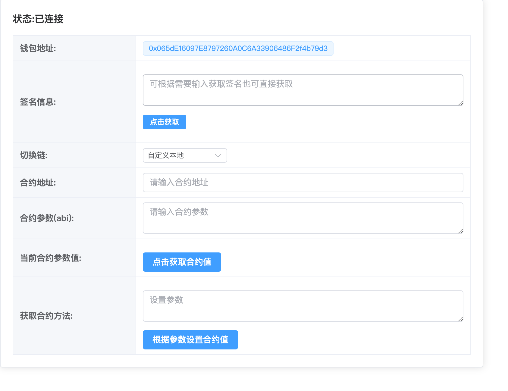

#### vite初始化一个vue项目
`npm create vite@latese`

#### 安装所需依赖
`npm install ethers web3modal element-plus`

#### 谷歌浏览器 
- 安装Metamask钱包插件

#### ethers文档 版本是5.7.2的 所以得看5.7的文档
[文档地址](https://docs.ethers.org/v5/getting-started/#getting-started--contracts)

#### 方法解释
 - getConnect 连接钱包
 - getSign 获取签名
 - selChange 切换链
 - getAbi 解析合约 调用合约方法

#### 注意项 (我是新手)
- EVM 版本 部署的时候要选择兼容版本  这两个可以 
- evm 版本: cancu 一直部署不上去 就是版本兼容问题
- 可以试试 berlin / istabul
- 注意获取合约方法这里 文档有解释的 
  - 参数不一样 不然报错的让你怀疑人生
  - 如果是查询 `view` 方法，使用 provider 
  - 如果是发送状态修改的交易，使用 signer

#### 界面截图


#### 地址访问
[预览地址](http://120.26.115.44/ethers/)

#### 预览事项
+ 本地使用的是Ganache 搭建的服务
+ Metamask的链用本地的

#### sol代码部分 
- 直接部署到Metamask钱包上面
``` solidity
// SPDX-License-Identifier: GPL-3.0
pragma solidity ^0.8.0;
contract DynamicContract {
     // 定义一个变量
    uint256 private  value;
    // 记录值的修改
    event Valuechanged(uint256 newValue);
    // 初始化值
    constructor(uint256 _value){
        value=_value;
    }
    // 获取值 (注意是 returns)
    function getValue() public  view  returns  (uint256){
        return value;
    } 
    // 设置值
    function setValue(uint256 _value) public {
        value=_value;
        emit Valuechanged(_value);//当值改变了 记录下值
    }
}
```
